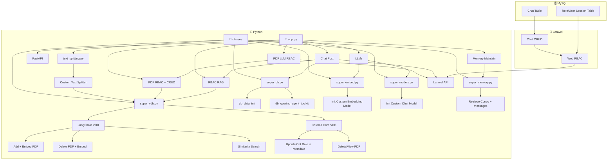

# 🧠 Syngenta AI Agent Hackathon Build  
### Paradox 2025 — IITM BS  

This project is part of a hackathon submission for the **Syngenta AI Agent Hackathon** held at **Paradox 2025, IITM BS**.

An intelligent industry grade knowledge retriving guide with role based access control   

🔗 **Demo Video**: [View Video](https://drive.google.com/file/d/1jWElGNz5UJZu725l0eCeE8LYizO4Lb0w/view?usp=sharing)  
🔗 **Problem Statement**: [View PDF](https://drive.google.com/file/d/1a9gaOJzXKhg4t05ra1uOhvWmn1EM8uAd/view)  
🔗 **Live Demo**: soon.

---

## 🔧 Tech Stack

| Layer          | Technologies |
|----------------|--------------|
| **Gen AI**     | Python → LangChain, ChromaDB |
| **Backend**    | FastAPI, MySQL, ChromaDB (Metadata Filtering) |
| **UI**         | Laravel, PHP, JavaScript, CSS, HTML |
| **Auth/RBAC**  | Session-based for web app |
| **Chat Storage** | MySQL |
| **Architecture** | MVC (UI + Laravel backend), emphasis on Controller |

---

## 📐 Design Architecture

> "I always wanted to build simple yet elegant systems that do more than they seem to — effortlessly."

- Built with a **modular mindset** to reuse the AI backend and models in future projects via APIs.
- Inspired by **terminal-style UIs** with buttons (keyboard navigation planned for future).
- Prioritized **functionality over flashy design**, resisting the JS/Python complexity trap.
- Chose **Laravel + PHP** for:
  - Simplicity of integration and library management
  - Strong MVC enforcement
  - Lowest deployment cost
  - Developer familiarity and speed

---

## 🔗 Data Flow & Connections

There are **three tightly coupled chains** in the architecture:

1. **UI ↔ Traditional Backend (Laravel)** → Standard MVC CRUD operations
2. **UI ↔ AI Backend (FastAPI + LangChain)** → PDF/LLM operations via API
3. **AI Backend ↔ Traditional Backend (Laravel)** → Uses shared MySQL DB, APIs for auth, sessions

Monolith is possible, but the separation allows **API-driven AI components**, making them reusable across future projects and platforms.

---

## 🗂️ Folder Structure & Component Map

## 📁 Python Structure

### Root Level

- **`app.py`**: Entry point of the FastAPI backend, orchestrating various functionalities including:
  - PDF operations
  - Chat interactions
  - RBAC-based LLM access
  - Memory maintenance

---

### 📁 `classes/`

#### 🧠 `super_db.py`
- Handles database interactions for querying and initialization.
- **Functions:**
  - `db_data_init`: Initializes data into the DB.
  - `db_quering_agent_toolkit`: Custom querying toolkit for chat agents.

#### 🔍 `super_embed.py`
- Manages the embedding model for vector operations.
- **Init Custom Embedding Model**: Loads and initializes a custom embedding model.

#### 🤖 `super_models.py`
- Loads the primary conversational model used by LLMs.
- **Init Custom Chat Model**: Bootstraps a custom LLM for chatting tasks.

#### 🗂️ `super_vdb.py`
- Abstraction layer over vector databases.

#### 🔢 LangChain VDB:
- **Add + Embed PDF**: Adds and embeds PDF data.
- **Delete PDF + Embed**: Deletes embedded PDFs.
- **Similarity Search**: Performs semantic search across documents.

#### Chroma Core VDB:
- **Update/Get Role in Metadata**: Manipulates and retrieves role metadata.
- **Delete/View PDF**: Manages PDF lifecycle.

#### 🧠 `super_memory.py`
- Handles conversational memory retrieval and tracking.
- **Retrieve Convo + Messages**: Manages past chat sessions.

#### ✂️ `text_splitting.py`
- Manages text chunking.
- **Custom Text Splitter**: Implements a custom algorithm for text splitting.
- Utilizes `super_vdb` for downstream vector operations.

---

### `app.py` Functional Blocks

- **FastAPI**: Web framework that wires all components.
- **pdf_crud**: PDF-based CRUD operations integrated with RBAC.
- **pdf_llm_rbac**: LLM-powered PDF operations respecting user roles.
- **llms**: Interfaces for LLMs using custom models and embeddings.
- **memory_maintain**: Manages long-term conversation context.
- **rbac_rag**: Combines RBAC and Retrieval-Augmented Generation (RAG).
- **chat_post**: Endpoints for interactive chat with LLM and PDF data.

---

## 📁 Laravel Structure

### 🌐 Laravel API Layer

- **`laravel_api`**: Central REST API layer that interfaces with Python services.
- **`web_rbac`**: Implements front-end and middleware-based RBAC logic.
- **`chat_crud`**: Handles chat session and message management.

---

##🗄️ MySQL Database Structure

- **`chat_table`**: Stores historical chat messages and threads.
- **`session_table`**: Maps users and roles to their active sessions.

---

## 🔄 Data Flow Overview

1. User interacts via Laravel Web Interface.
2. RBAC is enforced via `web_rbac`.
3. Laravel calls FastAPI (`laravel_api`) for document processing or chat tasks.
4. FastAPI routes requests to respective handlers in `classes/`.
5. PDFs are split, embedded, and stored using `super_vdb` and `super_embed`.
6. Chat context is managed using `super_memory`, and DB interactions via `super_db`.
7. MySQL backs persistent storage for chat and user-session metadata.

---

## 🔐 Role-Based Access Control (RBAC)

- Enforced in both:
  - Laravel (`web_rbac`)
  - Python (`pdf_llm_rbac`, `rbac_rag`)
- Role metadata is stored in MySQL and embedded alongside documents for context-sensitive access.

---

## 🤖 LLM + RAG Integration

- Uses custom models for embeddings and chat (`super_models`, `super_embed`).
- **Retrieval-Augmented Generation (`rbac_rag`)** enhances LLM answers with relevant document context.
- **Similarity search** ensures high relevance during document querying.

