This is part a hacakthon build i built for Syngenta AI Agent Hackathon at Paradox 2025 IITM BS

problem statement : [link](https://drive.google.com/file/d/1a9gaOJzXKhg4t05ra1uOhvWmn1EM8uAd/view)

tech stack: 
> Gen AI : Python ->langchain, chromadb
> Backend : fastapi , mysql , chroma db(meta-data-filtering) 
> UI : Laravel,php, javascipt, css, html
> Auth/RBAC : sessions based for web based app
> chat storage : mysql
> ui + laravel backend : MVC, more emphasis on controller :)

```mermaid
graph TD

%% Python Folder
subgraph PY["📁 Python"]
  Classes["📁 classes"]
  App["📄 app.py"]

  %% Classes folder files
  Classes --> super_db["super_db.py"]
  Classes --> super_embed["super_embed.py"]
  Classes --> super_models["super_models.py"]
  Classes --> super_vdb["super_vdb.py"]
  Classes --> super_memory["super_memory.py"]
  Classes --> text_splitting["text_splitting.py"]

  %% super_db.py contents
  super_db --> db_data_init["db_data_init"]
  super_db --> db_query_toolkit["db_quering_agent_toolkit"]

  %% super_embed.py
  super_embed --> embed_model["Init Custom Embedding Model"]

  %% super_models.py
  super_models --> chat_model["Init Custom Chat Model"]

  %% super_vdb.py
  super_vdb --> langchain_vdb["LangChain VDB"]
  super_vdb --> chroma_vdb["Chroma Core VDB"]

  langchain_vdb --> add_embed_pdf["Add + Embed PDF"]
  langchain_vdb --> delete_pdf_embed["Delete PDF + Embed"]
  langchain_vdb --> similarity_search["Similarity Search"]

  chroma_vdb --> role_metadata["Update/Get Role in Metadata"]
  chroma_vdb --> pdf_ops["Delete/View PDF"]

  %% super_memory.py
  super_memory --> retrieve_messages["Retrieve Convo + Messages"]

  %% text_splitting.py
  text_splitting --> text_splitter["Custom Text Splitter"]
  text_splitter --> super_vdb

  %% app.py structure
  App --> FastAPI["FastAPI"]
  App --> pdf_crud["PDF RBAC + CRUD"]
  App --> pdf_llm_rbac["PDF LLM RBAC"]
  App --> llms["LLMs"]
  App --> memory_maintain["Memory Maintain"]
  App --> rbac_rag["RBAC RAG"]
  App --> chat_post["Chat Post"]

  pdf_crud --> super_vdb
  pdf_llm_rbac --> pdf_crud
  pdf_llm_rbac --> laravel_api
  llms --> super_models
  llms --> super_embed
  memory_maintain --> super_memory
  rbac_rag --> super_vdb
  chat_post --> laravel_api
  chat_post --> rbac_rag
  chat_post --> super_db
end

%% Laravel Structure
subgraph LV["📁 Laravel"]
  laravel_api["Laravel API"]
  web_rbac["Web RBAC"]
  chat_crud["Chat CRUD"]

  web_rbac --> laravel_api
  chat_crud --> web_rbac
end

%% MySQL Structure
subgraph DB["🗄️ MySQL"]
  chat_table["Chat Table"]
  session_table["Role/User Session Table"]

  chat_table --> chat_crud
  session_table --> web_rbac
end
```

  
    chat_table --> chat_crud
    session_table --> web_rbac
  end
```
